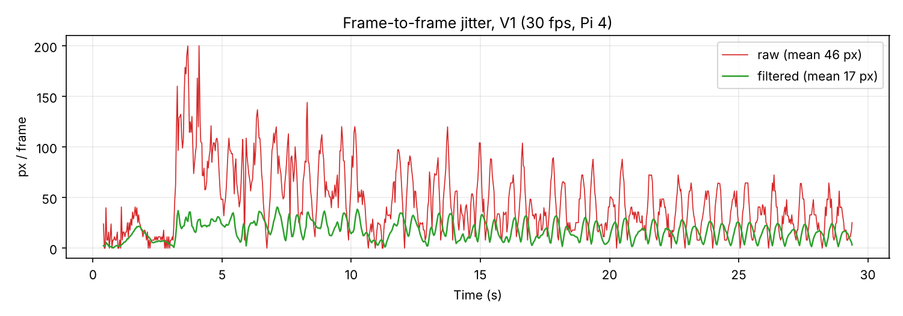
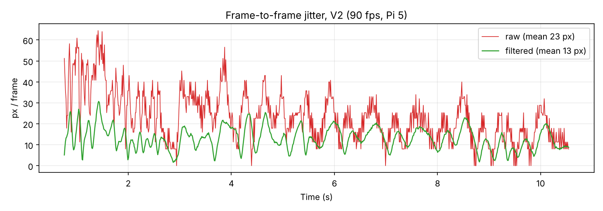
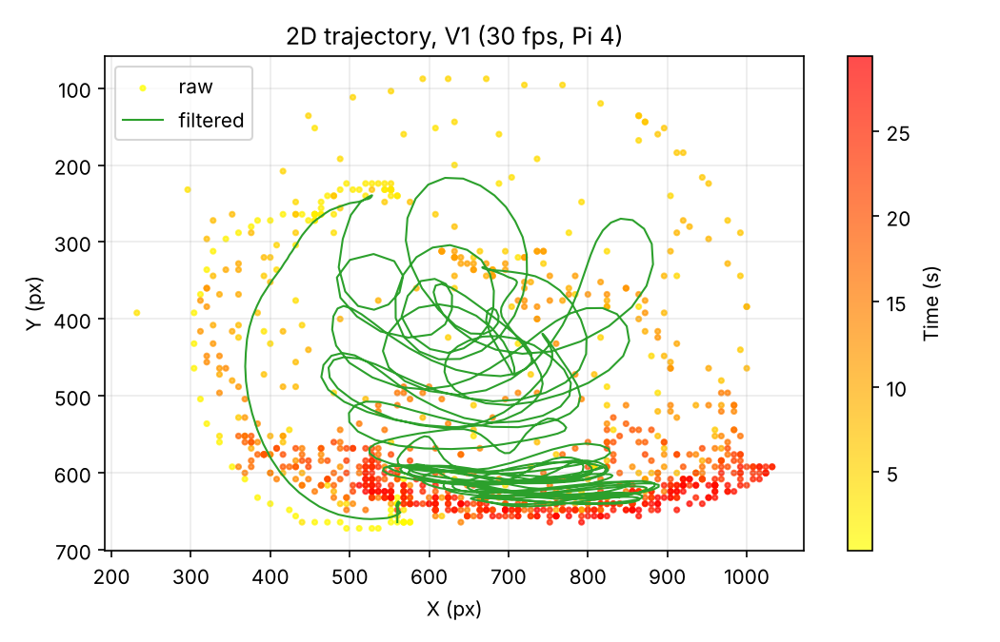
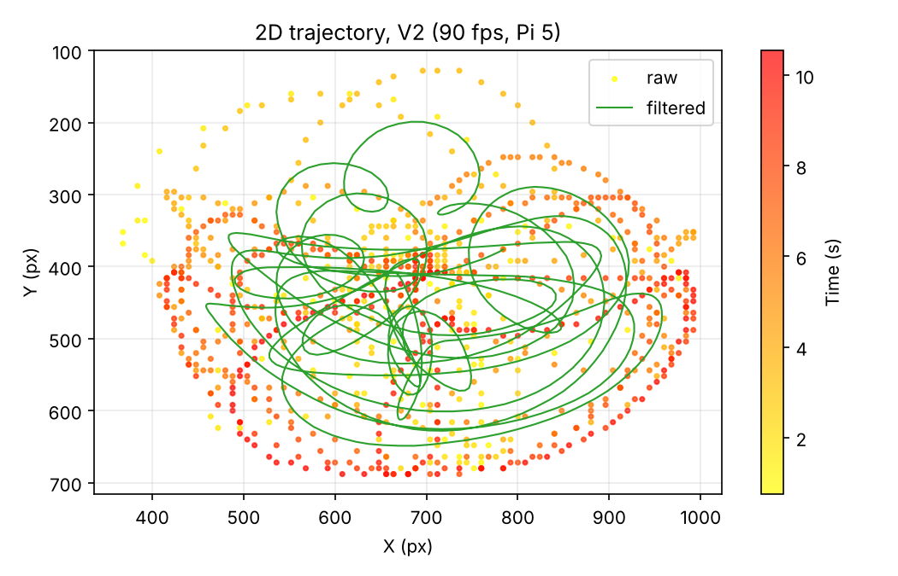
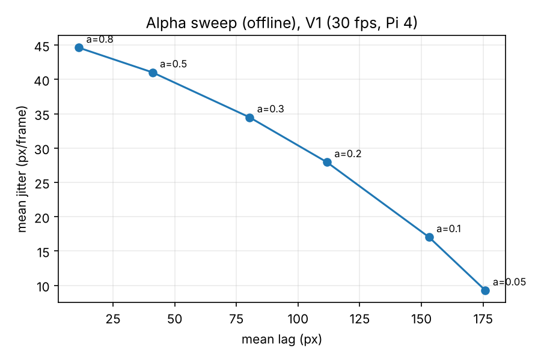
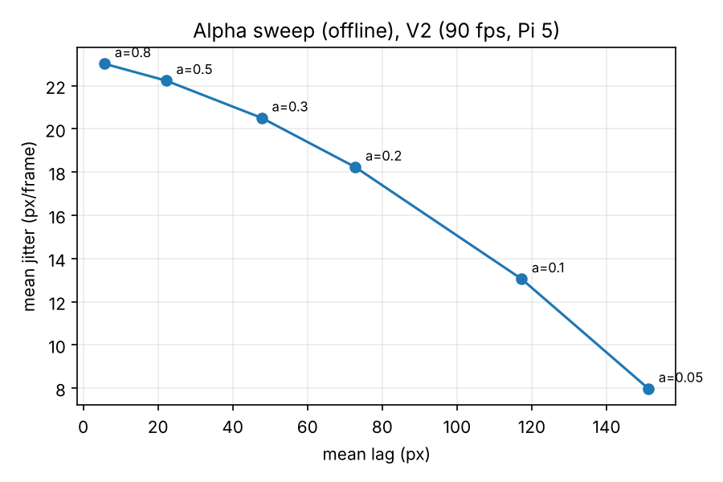

https://github.com/user-attachments/assets/f59c0ee8-f063-4a32-ae5f-da0409f96d76

# Motion Tracking with EMA Filtering

Real-time light tracking on a Raspberry Pi, with a first-order low-pass (exponential moving average) filter to stabilize noisy camera measurements. Built for the EECS 150 extra-credit project at UC Irvine.

A light is mounted on a double pendulum (chaotic, so the motion is unbiased) and tracked in the dark by a Raspberry Pi Camera Module 3. The same detection code runs with and without the filter, and the raw (red) and filtered (green) paths are compared frame by frame.

## Results

| Run | Setup | Raw jitter | Filtered jitter | Reduction | Mean lag |
|---|---|---|---|---|---|
| V1 | 30 fps, Pi 4, large light, slow swing | 46 px/frame | 17 px/frame | 63% | 153 px |
| V2 | 90 fps, Pi 5, small light, fast swing | 23 px/frame | 13 px/frame | 44% | 117 px |

- Jitter drops 44-63% at alpha = 0.1. V2 starts from less noise (higher fps means smaller per-frame displacement), so there is less left to remove.
- The cost is lag. At 30 fps, tau = 0.314 s, so the filter trails the signal by about 9-10 frames; at 17 px/frame that is about 153 px, matching the measured value.
- Alpha trades smoothness for responsiveness (see the sweep below).

| | |
|---|---|
|  |  |
|  |  |
|  |  |

The alpha sweep re-filters the recorded raw coordinates offline, so it isolates alpha from everything else in the setup. More plots (X/Y over time, lag) are in `results/`.

## How it works

Pipeline per frame (`src/sensor_project_code.py`):

1. Capture a 1280x720 frame with `picamera2`
2. Downsize to 160x90 for speed
3. Convert to grayscale
4. Threshold at brightness 220 to find the light
5. Morphological open (3x3 ellipse) to remove small noise blobs
6. Find external contours, take the largest, compute its centroid from image moments
7. Rescale the centroid back to full resolution
8. Apply the EMA filter: `y[n] = a*x[n] + (1-a)*y[n-1]`
9. Log timestamp, raw and filtered coordinates, and contour count to CSV
10. Draw the last 20 points of both traces on the frame and write it to video

See [docs/filter-math.md](docs/filter-math.md) for how the EMA relates to the continuous first-order filter and how tau and the cutoff frequency are derived.

## Repo layout

```
src/sensor_project_code.py   capture, detect, filter, record (runs on the Pi)
analysis/analyze.py          jitter / lag / alpha-sweep analysis and plots
data/                        recorded tracking CSVs (V1 30 fps, V2 90 fps)
results/                     generated plots and summary tables
docs/filter-math.md          filter derivation and parameter notes
```

## Usage

On the Raspberry Pi (camera module attached):

```bash
sudo apt install python3-picamera2 python3-opencv python3-numpy
python3 src/sensor_project_code.py     # Ctrl+C to stop
```

This writes `tracking_comparison.avi` and `tracking_data.csv`. Tunable constants are at the top of the file: `ALPHA`, `VIDEO_FPS`, `BRIGHTNESS_THRESHOLD`, `MIN_CONTOUR_AREA`. V2 was recorded with `VIDEO_FPS = 90`.

To reproduce the analysis (any machine):

```bash
pip install -r requirements.txt
python3 analysis/analyze.py
```

## Parameters studied

FPS, resolution, alpha (filter weight), light brightness/size, and CPU (Pi 4 vs Pi 5).

## Future work

- Dynamic alpha based on object velocity, to cut lag during fast motion while keeping smoothing when the light is slow
- Other filters (Kalman, higher-order low-pass) on the same setup
- Object detection model in place of brightness thresholding

## Team

- Jeremiah Yong: custom detection model for light and objects
- Daniel Wong: low-pass filter, detection debugging, testing
- Michael Bakhtiar: double pendulum and light rig (3D printed), results analysis
